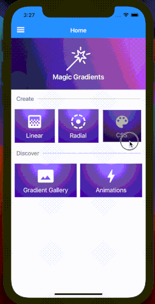

# Magic Gradients


([this picture is draggable, check it out](https://my.spline.design/magicgradientsprod-1071ec2e781f07bf24ab0012e50089f9/))

Draw breathtaking backgrounds in your Xamarin.Forms application today, from simple gradients to complex textures. It's a kind of magic :sparkles:

| Supported platforms |
|---|
| :heavy_check_mark: Android |
| :heavy_check_mark: iOS |
| :heavy_check_mark: UWP |

- Linear and radial gradients supported
- Draw as many gradients as you want with single control, blend them together for unique effects
- Supports CSS gradients, find your ideal background [somewhere on the web](https://www.gradientmagic.com/) and copy + paste into your app
- Make your background alive with built-in XAML animations :hear_no_evil:
- Powered by [](https://www.nuget.org/packages/SkiaSharp/)

## Installation 

`Magic Gradients` are available via NuGet:

  [](https://www.nuget.org/packages/MagicGradients)

Install into shared project, no additional setup required.

## Drawing gradient

To draw a gradient add `GradientView` control to your XAML page and create `LinearGradient` or `RadialGradient` as direct content.

``` xml
<magic:GradientView>
    <magic:LinearGradient>
        <magic:GradientStop Color="Red" />
        <magic:GradientStop Color="Yellow" />
    </magic:LinearGradient>
</magic:GradientView>
```

It is also possible to add collection of gradients. You can mix linear and radial gradients, use transparency in color definitions to get blend effect. 

``` xml
<magic:GradientView>
    <magic:GradientCollection>
        <magic:LinearGradient Angle="45">
            <magic:GradientStop Color="Orange" Offset="0" />
            <magic:GradientStop Color="#ff0000" Offset="0.6" />
        </magic:LinearGradient>
        <magic:LinearGradient Angle="90">
            <magic:GradientStop Color="#33ff0000" Offset="0.4" />
            <magic:GradientStop Color="#ff00ff00" Offset="1" />
        </magic:LinearGradient>
    </magic:GradientCollection>
</magic:GradientView>
```

You can also build gradient in C# using `GradientBuilder` with Fluent API:

``` c#
 var gradients = new GradientBuilder()
    .AddLinearGradient(g => g
        .Rotate(45)
        .AddStop(Color.Red, Offset.Prop(0.2))
        .AddStop(Color.Blue, Offset.Prop(0.4)))
    .AddRadialGradient(g => g
        .Circle().At(0.5, 0.5, o => o.Proportional())
        .Radius(200, 200, o => o.Absolute())
        .StretchTo(RadialGradientSize.FarthestSide)
        .Repeat()
        .AddStops(Color.Red, Color.Green, Color.Blue))
    .AddCssGradient("linear-gradient(red, orange)")
    .Build();
```

To apply gradient created in C#, you can use `ToSource()` extension method:

``` c#
 var source = new GradientBuilder()
    .AddLinearGradient(g => g
        .Rotate(20)
        .AddStops(Color.Red, Color.Green, Color.Blue))
    .ToSource();

gradientView.GradientSource = source;
```

## Discover amazing backgounds


In `Magic Gradients` repository you can find `Magic Playground`, a `Xamarin.Forms` app for browsing and creating gradients visually. Android, iOS and UWP are supported.

Be sure to check out the `Gallery`. It contains over **1700+** samples :hear_no_evil: from [Gradient Magic](https://www.gradientmagic.com/), ready to use in any `Xamarin.Forms` app. Find your best, pick and copy over to your app.

<div>
   
  
 
</div>

## Styling with CSS

Magic Gradients supports [CSS functions](https://www.w3schools.com/css/css3_gradients.asp). CSS gradient can be embeded in XAML inline:

``` xml
<magic:GradientView>
    <magic:CssGradientSource>
        <x:String>
            <![CDATA[
                linear-gradient(242deg, red, green, orange)
            ]]>
        </x:String>
    </magic:CssGradientSource>
</magic:GradientView>
```

Styling from CSS stylesheet is also possible:

``` xml
<magic:GradientView StyleClass="myGradient" />
```

``` css
.myGradient {
    background: linear-gradient(90deg, rgb(235, 216, 9), rgb(202, 60, 134));
}
```

CSS can be also set via C#:

``` C#
gradientView.GradientSource = CssGradientSource.Parse("linear-gradient(red, green, blue)");
```

### Linear gradient functions

|  |  |
|:-----:|:-----:|
| [`linear-gradient`](https://developer.mozilla.org/en-US/docs/Web/CSS/linear-gradient) | [`repeating-linear-gradient`](https://developer.mozilla.org/en-US/docs/Web/CSS/repeating-linear-gradient) |

**CSS Syntax**
``` css
linear-gradient(direction | angle, color-stop1, color-stop2, ...);
```

| Value | Description |
| ------| ----------- |
| `direction` | Possible values: `to left`, `to right`, `to top`, `to bottom`, `to left top`, `to right bottom` etc. |
| `angle` | In degrees (`135deg`) or proportional (`0.45turn`, range between 0-1) |

Each color stop should contain color information and optionally position described in percents or pixels. Suppored color formats:

- colors in RGB or HSL format: `rgb(red, green, blue)`, `rgba(red, green, blue, alpha)`, `hsl(hue, saturation, lightness)`, `hsla(hue, saturation, lightness, alpha)`
- colors in hex: `#ff0000`
- named colors: `red`, `green`, `blue`, `orange`, `pink`

### Radial gradient functions

|  |  |
|:-----:|:-----:|
| [`radial-gradient`](https://developer.mozilla.org/en-US/docs/Web/CSS/radial-gradient) | [`repeating-radial-gradient`](https://developer.mozilla.org/en-US/docs/Web/CSS/repeating-radial-gradient) |

**CSS Syntax**
``` css
radial-gradient(shape size at position, start-color, ..., last-color);
```

| Value | Description |
| ------| ----------- |
| `shape` | Possible values: `circle`, `ellipse` |
| `size` | In pixels (`px`), proportional (`%`) or named sizes: `closest-side`, `closest-corner`, `farthest-side`, `farthest-corner` (default) |
| `position` | In pixels (`px`), proportional (`%`) or named directions: `left`, `right`, `top`, `bottom`, `center` |

**Examples**
``` css
radial-gradient(circle at top left, red, green);
radial-gradient(circle 100px at 70% 20%, red, green);           // one radius for circle
radial-gradient(ellipse closest-corner at 30% 80%, red, green);
radial-gradient(ellipse 200px 300px at 50% 60%, red, green);    // two radiuses for ellipse
```

### Play with CSS

You can play around with CSS functions live in Magic Playground app, Hot Reload :fire: included.

 

<!--
### Examples

``` css
linear-gradient(45deg, blue, red);
linear-gradient(to left top, blue, red);
linear-gradient(0deg, blue, green 40%, red);
radial-gradient(cyan 0%, transparent 20%, salmon 40%);
radial-gradient(farthest-corner at 40px 40px, #f35 0%, #43e 100%);
```
-->

## Animations (preview)

``` xml
xmlns:anim="clr-namespace:MagicGradients.Animation;assembly=MagicGradients"
```

| Timeline property | Values |   |
| ----------------- | ---- | --- |
| `Target` | `{x:Reference myGradient}` | Reference to animated element. |
| `Duration` | `3000` | Length of single loop (in ms). |
| `Delay` | `200` | Time before animations starts (in ms). |
| `Easing` | `{x:Static Easing.SinInOut}` | Easing function. |            
| `RepeatBehavior` | `1x`, `3x`, `Forever`  | How many times animation must be repeated. |
| `AutoReverse` | `True`, `False` | If true, next loop will be animated backwards. |


 

### Running animation

Run automatically:

``` xml
<magic:GradientView.Behaviors>
    <anim:Animate>
        <anim:DoubleAnimation ... />
    </anim:Animate>
</magic:GradientView.Behaviors>
```

Control animation from view model:

``` xml
<magic:GradientView.Triggers>
    <anim:AnimateTrigger IsRunning="{Binding IsRunning}">
         <anim:PointAnimation ... />
    </anim:AnimateTrigger>
</magic:GradientView.Triggers>
```

`AnimateTrigger` is a `MarkupExtension`. It's shorter way of creating `DataTrigger` with `BeginAnimation` and `EndAnimation` as `EnterActions` and `ExitActions`.

### Property animations

With this type of animation you can animate single property between two values defined as `From` and `To`.

| Properties | Value |    |
| ---------- | ------| --- |
| `TargetProperty` | `magic:GradientStop.Color` | Animated property with full namespace. |
| `From` | Value matching `TargetProperty` type |  Value when animation starts. |
| `To` | Value matching `TargetProperty` type | Value when animation ends. |

Animate color sample:

``` xml
<anim:ColorAnimation Target="{x:Reference AnimColor}" 
                     TargetProperty="magic:GradientStop.Color" 
                     From="Red" To="Yellow" 
                     Duration="3000"
                     RepeatBehavior="Forever" 
                     AutoReverse="True" />
```

Built-in property types:

`ColorAnimation`, `DimensionsAnimation`, `DoubleAnimation`, `IntegerAnimation`, `OffsetAnimation`, `PointAnimation`, `ThicknessAnimation`

For custom types, see Custom animation types.

### Storyboards

| Attached properties | Values |    |
| ------------------- | ------ | -- |
| `anim:Storyboard.BeginAt` | `from 0 to 1` | Start animation at given point of `Storyboard`. |
| `anim:Storyboard.FinishAt` | `from 0 to 1` | End animation at given point of `Storyboard`. |

Animate two colors at different times:

``` xml
<anim:Storyboard Duration="4000" RepeatBehavior="Forever">
    <anim:ColorAnimation Target="{x:Reference Color1}" 
                         TargetProperty="magic:GradientStop.Color" 
                         From="White" To="Red" 
                         anim:Storyboard.BeginAt="0"
                         anim:Storyboard.FinishAt="0.8"
                         AutoReverse="True" />
    <anim:ColorAnimation Target="{x:Reference Color2}" 
                         TargetProperty="magic:GradientStop.Color" 
                         From="LightGray" To="DarkRed" 
                         anim:Storyboard.BeginAt="0.3"
                         anim:Storyboard.FinishAt="1"
                         AutoReverse="True" />
</anim:Storyboard>
```

### KeyFrame animations

`<Type>AnimationUsingKeyFrames`

`<Type>KeyFrame` properties:
- `KeyTime` - time when value is applied to animated target
- `Value` - of type `<Type>`
- `Easing` - easing function

Move radial circle between corners, at different times:

``` xml
<anim:PointAnimationUsingKeyFrames Target="{x:Reference Radial2}" 
                                   TargetProperty="magic:RadialGradient.Center" 
                                   RepeatBehavior="Forever">
    <anim:PointKeyFrame KeyTime="1000" Value="0.9,0.1" />
    <anim:PointKeyFrame KeyTime="1500" Value="0.9,0.9" />
    <anim:PointKeyFrame KeyTime="2500" Value="0.1,0.9" Easing="{x:Static Easing.SinInOut}" />
    <anim:PointKeyFrame KeyTime="3000" Value="0.1,0.1" />
</anim:PointAnimationUsingKeyFrames>
```

## Advanced features

### Color positions

Similar to CSS, with Magic Gradient you can posion each color with proportional value or by absolute pixels.

``` xml
<magic:GradientView>
    <magic:LinearGradient>
        <magic:GradientStop Color="Red" />
        <magic:GradientStop Color="Yellow" Offset="100px" />
        <magic:GradientStop Color="Green" Offset="40%" />
        <magic:GradientStop Color="Blue" Offset="0.8" />
    </magic:LinearGradient>
</magic:GradientView>
```

Offset types:
- `0.3`, `30%` - proportional, `Offset.Prop(0.3)` in code
- `200px` - absolute, `Offset.Abs(200)` in code
- leave blank - each undefined offset will be calculated like in CSS

### Backgroud size and position

`GradientView` let's you specify size of the background with `GradientSize` property:

```xml
<GradientView GradientSource="..." GradientSize="0.6,0.6">
<GradientView GradientSource="..." GradientSize="200px,200px">
```

Proportional and absolute values are supported. Size can also be set from CSS:

``` css
.myGradient {
    background: ...;
    background-size: 60px 60px;
}
```

When size is set, gradient will be tiled to fill available space. You can change tile mode with `GradientRepeat` property. Supported values:
- `Repeat`, `repeat`
- `RepeatX`, `repeat-x`
- `RepeatY`, `repeat-y`
- `NoRepeat`, `no-repeat`

Repeat mode can be set from CSS as well:

``` css
.myGradient {
    background: ...;
    background-size: 60px 60px;
    background-repeat: repeat-x;
}
```

### Custom animation types

- create `ITweener` implementation

``` C#
public class DoubleTweener : ITweener<double>
{
    public double Tween(double @from, double to, double progress)
    {
        return from + (to - from) * progress;
    }
}
```

- define animations

``` C#
public class DoubleAnimation : PropertyAnimation<double>
{
    public override ITweener<double> Tweener { get; } = new DoubleTweener();
}

public class DoubleAnimationUsingKeyFrames : PropertyAnimationUsingKeyFrames<double>
{
    public override ITweener<double> Tweener { get; } = new DoubleTweener();
}

public class DoubleKeyFrame : KeyFrame<double> { }
```

# Articles
- [Gradient Background for your Xamarin.Forms App - blog post](https://medium.com/@benetskyybogdan/gradient-background-for-your-xamarin-forms-app-6d7e46fba558)
- [XF Shell Gradient Flyout with Magic Gradients - blog post](https://medium.com/@benetskyybogdan/xf-shell-gradient-flyout-with-magic-gradients-e9f0eb46bae0)
- [How we extended Xamarin.Forms CSS to style GradientView - blog post](https://medium.com/@benetskyybogdan/xamarin-forms-custom-css-properties-d75872bea20e)
- [Xamarin.Forms Gradient Background For All Pages in 1 minute - blog post](https://medium.com/@benetskyybogdan/xamarin-forms-gradient-background-for-all-pages-in-1-minute-9e172d986618)

---
<div>Icons made by <a href="https://www.flaticon.com/authors/icongeek26" title="Icongeek26">Icongeek26</a> from <a href="https://www.flaticon.com/" title="Flaticon">www.flaticon.com</a></div>
